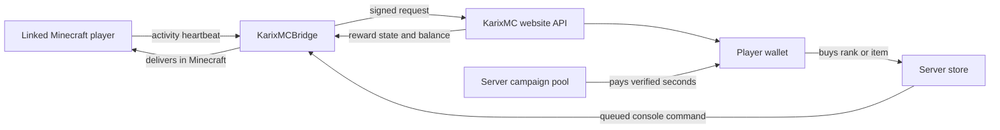

# KarixMC Bridge 0.5.0 - Client Testing Guide

This guide is for testing the KarixMC website with a real Paper Minecraft server.

## Test addresses

- Website: `http://51.83.180.202:3000`
- Plugin page: `http://51.83.180.202:3000/plugin`
- Account and Creator Studio: `http://51.83.180.202:3000/account`
- Minecraft join address: the address of your separate Minecraft server, not the website VPS address

The website VPS and Minecraft server may be on different machines. The Minecraft server only needs outbound access to `http://51.83.180.202:3000`.

## How the system connects



## Part 1 - Prepare the Minecraft server

Requirements:

- Paper or Purpur server, version 1.20.x or 1.21.x
- Java 17 or newer; Java 21 is recommended for modern 1.21 servers
- Outbound network access from the Minecraft host to `51.83.180.202:3000`
- Do not install both the old and new bridge jars

If the old plugin is installed:

1. Stop the Minecraft server.
2. Remove `MinePulseBridge-0.4.0.jar` from `plugins/`.
3. Keep the old config temporarily so its three values can be copied later.
4. Do not run the old and new jars together because their commands will conflict.

## Part 2 - Create the owner account and server listing

1. Open `http://51.83.180.202:3000/signup`.
2. Create a separate account for the server owner.
3. Sign in and open `Account -> Your servers`.
4. Select `List a new server`.
5. Enter the Minecraft host and port.
6. Do not enter the website URL in the Minecraft Host field.
7. Save the listing.

Example:

```text
Minecraft Host: play.example.com
Minecraft Port: 25565
```

The website prevents the same host and port from being registered twice. Contact the KarixMC administrator if a legitimate server is already claimed.

## Part 3 - Install and configure KarixMCBridge

1. Download `KarixMCBridge-0.5.0.jar` from `http://51.83.180.202:3000/plugin`.
2. Put the jar in the Minecraft server's `plugins/` directory.
3. Start Paper once.
4. Stop Paper after `plugins/KarixMCBridge/config.yml` is created.
5. On the website, open `Account -> Your servers -> Bridge`.
6. Copy the Website API URL, Server ID, and Plugin secret.
7. Edit `plugins/KarixMCBridge/config.yml`:

```yaml
api-base-url: "http://51.83.180.202:3000"
server-id: "COPY_THE_SERVER_ID_FROM_CREATOR_STUDIO"
plugin-secret: "COPY_THE_PLUGIN_SECRET_FROM_CREATOR_STUDIO"
```

8. Save the file and start Paper again.
9. Run `/plugins`. `KarixMCBridge` should be green.
10. Check the Paper console for `KarixMC website policy synced`.
11. Refresh Creator Studio. It should show `Plugin reached website`.

Important:

- Never use `localhost` unless the website runs on the same machine as Paper.
- Do not add `/account`, `/wallet`, or `/api` to `api-base-url`.
- There is no separate wallet URL. The wallet is part of the KarixMC account page.
- Keep the plugin secret private. If it leaks, use Rotate secret in Creator Studio, update `config.yml`, and restart Paper.
- `Plugin reached website` can appear with zero players online.
- `Last player activity` appears only after a player joins and sends a heartbeat.

## Part 4 - Fund the campaign pool

The campaign pool belongs to one server and pays players for verified seconds.

1. Sign in as the server owner.
2. Open `Account -> Your servers`.
3. Find `Campaign -> Fund player rewards`.
4. Optionally enter promo code `BOOST10` for 10% extra campaign credits.
5. Select a package such as 250K, 1M, or 5M.
6. Confirm that Campaign credits increased.

For the current MVP test, package buttons simulate a successful purchase and credit the pool immediately. They do not charge a real card yet. A payment provider and webhook verification are still required before real-money launch.

When the campaign pool reaches zero:

- players stop earning;
- players receive an empty-pool message;
- the server disappears from the public marketplace;
- the listing returns after the owner funds it again.

## Part 5 - Link a player's Minecraft account

Only linked players earn points. People who join without a KarixMC account can play normally but receive no rewards.

1. Create a separate website account for the player.
2. Sign in as that player.
3. Open `Account -> Minecraft identity`.
4. Select `Create link code`.
5. Join the Minecraft server using the same Minecraft account that should earn rewards.
6. Run the generated command within ten minutes:

```text
/karixmc link ABC123
```

7. The player should receive a successful link message.
8. Run `/points` to confirm the wallet is available.

The old `/minepulse link` command remains as a compatibility alias, but all new instructions use `/karixmc`.

## Balance terminology

| Term | Meaning | Increases when | Decreases when |
| --- | --- | --- | --- |
| Campaign pool | Credits owned by one server for rewarding players | Owner funds a package or receives a promo bonus | Verified players earn points on that server |
| Wallet | The player's total spendable points across KarixMC | Verified play, level rewards, admin grants, or the 20-hour claim | Player buys a server rank or item |
| Session earned | Points earned during the latest continuous play session on this server | A verified heartbeat is rewarded | It does not decrease; a later session starts a new session total |
| Verified play | Active seconds accepted by the website | Player is linked, active, within a paid slot, and passes required checks | It is a duration, not a balance |
| AFK time | Seconds reported after the configured idle timeout | No meaningful movement, chat, command, or inventory activity | It is tracked separately and never earns points |

Campaign credits and wallet points are deliberately separate:

- An owner cannot spend campaign credits in a server store.
- A player cannot use wallet points to fund a campaign.
- Buying campaign credits does not increase the buyer's wallet.
- A wallet can spend earned points on any listed server's store, subject to that item's rules.

## How verified play works

Default settings for a new server:

| Rule | Default |
| --- | --- |
| Heartbeat interval | 20 seconds |
| AFK timeout | 300 seconds |
| Activity challenge interval | 300 seconds |
| Challenge answer window | 90 seconds |
| Purchase polling | 15 seconds |
| Minimum movement distance | 0.2 blocks |
| Minimum interactions per heartbeat | 1 |
| Paid-player cap | 20 players |
| Reward rate | 1 point per second |

The owner can change protection settings in Creator Studio. Policy sync runs every minute, so most settings do not require a Paper restart.

A heartbeat earns points only when all required conditions pass:

1. The plugin credentials are valid.
2. The player has linked a website account.
3. The listing is Active and not suspended or blacklisted.
4. The campaign pool contains points.
5. The reward rate is enabled.
6. The player owns one of the server's paid-player slots.
7. The player is not AFK.
8. Meaningful movement or interaction was detected.
9. Any required arithmetic activity check has been answered.

The website calculates rewards. The plugin cannot directly add wallet points. Fractional rates such as 1.5 points per second use a session carry so fractions are not lost.

## Reward messages players should see

The plugin sends a message when the state changes and repeats paused messages at most once per minute.

| State | Expected message or behavior |
| --- | --- |
| EARNING | Verified play is active and shows the current points-per-second rate |
| ACCOUNT_NOT_LINKED | Link the KarixMC account before rewards can start |
| AFK | Move or interact to continue earning |
| INACTIVE | Meaningful movement, chat, command, or inventory activity is required |
| ACTIVITY_CHECK | Use `/answer <value>` before rewards resume |
| PAID_CAP | All owner-funded player slots are currently occupied |
| EMPTY_POOL | The server owner must fund the campaign pool |
| REWARDS_DISABLED | The server owner has disabled the reward rate |

When the player becomes valid again, the plugin sends a green earning/resumed message.

## Paid-player cap behavior

If the cap is 20 and 25 linked players are online:

- the first 20 active sessions hold reward slots;
- the other five can still play but do not earn;
- extra players receive the paid-cap message;
- when a rewarded player leaves and their session becomes stale, a waiting player can receive the available slot.

## Activity challenge test

For a quicker test, temporarily use these Creator Studio settings:

```text
Challenge enabled: Yes
Challenge required: Yes
Challenge every: 60 seconds
Answer window: 60 seconds
AFK after: 60 seconds
```

Expected flow:

1. Play actively for about one minute.
2. The server displays a question such as `How much is 2 + 3?`.
3. Rewards pause.
4. Submit a wrong answer and confirm it is rejected.
5. Run `/answer 5` with the correct answer.
6. The plugin confirms the check.
7. The next valid heartbeat resumes rewards.

## AFK and inactivity test

1. Set AFK timeout to 60 seconds for testing.
2. Run `/points` and note Wallet and Session earned.
3. Stop moving, chatting, using commands, and clicking inventory items.
4. Wait at least 60 seconds plus one heartbeat.
5. Confirm the AFK pause message appears.
6. Run `/points` again and confirm Session earned did not increase during the AFK period.
7. Move far enough or interact.
8. Wait for the next heartbeat and confirm the green earning message appears.

Looking around without changing position is not sufficient meaningful movement. Tiny client jitter is ignored by the configured movement threshold.

## Point earning test

1. Set reward rate to `1` point per second.
2. Confirm the campaign pool is funded.
3. Confirm the player is linked.
4. Play actively for about two minutes without missing a required challenge.
5. Run `/points` before and after.
6. Wallet and Session earned should increase by approximately the verified active seconds.
7. Run `/pool` and confirm the campaign pool decreased by the awarded amount.

Rewards arrive in heartbeat batches, not once every screen-rendered second. A short delay is expected.

## Store purchase and delivery test

Owner setup:

1. Open Creator Studio for the server.
2. Open Store items.
3. Create a cheap test item, for example 100 points.
4. Enter a console command using `{player}` or `{uuid}`.

Example:

```text
give {player} diamond 1
```

Player test:

1. Make sure the player has enough wallet points and is linked.
2. Open the server profile on the website.
3. Buy the test item.
4. If the item requires online delivery, stay on that Minecraft server.
5. The plugin normally delivers it within the purchase polling interval.
6. Run `/receive` to request an immediate retry.
7. Confirm the wallet decreased and the item or rank was delivered.

If a console command fails, the purchase acknowledgement marks it failed and refunds the wallet points. Commands must be valid console commands and should not include a leading slash.

## Plugin commands

| Command | Purpose |
| --- | --- |
| `/points` | Show wallet, latest session earnings, and verified playtime |
| `/pool` | Show this server's campaign pool and reward rate |
| `/answer <value>` | Answer a required activity check |
| `/receive` | Retry pending store deliveries |
| `/karixmc link <code>` | Link the current Minecraft UUID to a website account |
| `/karixmc help` | Show bridge commands |

Legacy aliases `/minepulse ...` and `/mpcode <value>` remain available during migration.

## Security and anti-cheat rules

- Every heartbeat is signed with HMAC-SHA256 using the server's private plugin secret.
- Requests with invalid secrets are rejected.
- Heartbeat timestamps must be recent.
- A unique nonce prevents replaying the same heartbeat.
- The website calculates balances and pool deductions in database transactions.
- IP addresses are stored as hashes rather than plain text.
- Suspicious AFK, inactivity, and failed-check behavior raises the session risk score.
- Players can report missing rewards, tampering, bots, scams, or abusive content.
- Admins can pause, blacklist, remove credits, or restore a server.

No plugin can fully stop a machine owner from modifying their own server software. KarixMC therefore combines signed telemetry, server-side accounting, activity checks, reports, trust states, and administrator enforcement.

## Complete client acceptance checklist

- [ ] `/plugins` shows `KarixMCBridge` in green.
- [ ] Creator Studio shows `Plugin reached website`.
- [ ] A separate player account can generate a link code.
- [ ] `/karixmc link <code>` links the correct Minecraft account.
- [ ] `/pool` displays the funded campaign and reward rate.
- [ ] Active play increases Wallet, Session earned, and Verified play.
- [ ] AFK play shows a pause reason and awards zero points.
- [ ] Inactivity shows a pause reason and awards zero points.
- [ ] A required arithmetic check pauses rewards until correctly answered.
- [ ] A player outside the paid cap receives the paid-cap message.
- [ ] Empty campaign pool stops rewards and hides the listing.
- [ ] A website store purchase is delivered as a Minecraft console command.
- [ ] `/receive` retries pending online delivery.
- [ ] Invalid plugin secret produces `Invalid server credentials` in the Paper log.
- [ ] Rotating a secret invalidates the old config until the new value is installed.

## Troubleshooting

### Plugin is red or missing in `/plugins`

- Confirm the server is Paper or Purpur.
- Confirm Java 17 or newer.
- Remove the old bridge jar so only one KarixMC bridge is installed.
- Read the Paper startup exception in `logs/latest.log`.

### Creator Studio says Waiting for plugin

- Check all three `config.yml` values.
- From the Minecraft host, test `curl http://51.83.180.202:3000/plugin`.
- Confirm outbound TCP port 3000 is allowed.
- Do not use `localhost` when the website is on another machine.
- Synchronize the Minecraft host clock with NTP.
- Restart Paper after changing the local connection values.

### Plugin connects but Last player activity is empty

- Join the Minecraft server with at least one player.
- Wait one heartbeat interval.
- Policy sync alone does not count as player activity.

### Player receives no points

- Read the new reward-state message first.
- Confirm the player linked the correct Minecraft UUID.
- Confirm the campaign pool is funded.
- Confirm the listing is Active.
- Confirm the player is within the paid cap.
- Confirm the player is not AFK or inactive.
- Complete any pending `/answer` challenge.

### Address displays with two ports

Save the server profile again. KarixMC normalizes `host:port` and the separate Port field into one valid join address.
