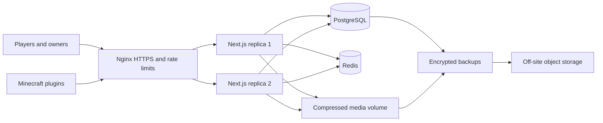

# KarixMC Production Runbook

## Release status

This branch is a production candidate for a 50-200 concurrent-user public beta. It uses PostgreSQL for durable data, Redis for shared rate limits and short-lived marketplace caching, two isolated Next.js application replicas, Nginx for TLS and load balancing, persistent compressed media, and recurring database/media backups.

Automated payment collection remains deliberately disabled with `PAYMENTS_ENABLED=false`. Campaign credit and premium orders are coordinated through the official Discord, then recorded by an administrator after manual confirmation. Staff must never request account passwords, TOTP codes, plugin secrets, or private keys through Discord.

## Production architecture



The proposed 8-vCPU, 16 GB RAM, 100 GB SSD VPS is suitable for this beta. Container limits reserve 2 GB and 2 CPUs for each app replica, 6 GB and 3 CPUs for PostgreSQL, and 512 MB for Redis, leaving capacity for Ubuntu, Nginx, Docker, backups, and short spikes.

## Confirmed launch identity

- Primary origin: `https://karixmc.pl`
- Official Discord: `https://discord.gg/6sWTyFEXxR`
- Initial administrator/support contact: `karixai@proton.me`
- Operator display name: `KarixMC` (independent project; no company is being claimed)
- Data decision: start production with a fresh PostgreSQL database; keep the current VPS and its database as isolated staging.

## Information still required

Do not send production passwords or private keys in chat or commit them to Git.

1. DNS access to create `A` records for `karixmc.pl` and `www.karixmc.pl` pointing to `54.37.223.34`.
2. SMTP credentials and a verified sender such as `no-reply@karixmc.pl` for signup verification and password recovery. A normal Proton mailbox address is the recipient/contact identity, not a transactional SMTP service by itself.
3. A human legal review of the privacy, terms, manual-order, and refund wording for the countries served. Add a postal operator address only if counsel confirms it is required and accurate.
4. An `age` backup public recipient and an off-site destination supported by `rclone`.
5. An alert webhook plus an external uptime monitor. The VPS timer cannot report when the entire VPS is offline.
6. Enter the initial administrator password and TOTP setup privately on the VPS.
7. Later: the selected automated payment provider and supported currencies. Keep automated payments disabled until then.

## 1. Prepare the VPS

Point the DNS records to the VPS first. Log in with a temporary privileged account, clone the approved repository to `/opt/karixmc`, and run:

```bash
sudo bash deploy/scripts/provision-ubuntu.sh
```

Add an SSH key for the `karixmc` user and verify a second SSH session before disabling root login and password authentication in `/etc/ssh/sshd_config`.

## 2. Configure production

```bash
cd /opt/karixmc
cp .env.production.example .env.production
chmod 600 .env.production
nano .env.production
```

Generate every secret independently on the VPS. Hex output is URL-safe and shell-safe:

```bash
openssl rand -hex 32
```

Use different values for PostgreSQL, Redis, `AUTH_SECRET`, `PLUGIN_SECRET_ENCRYPTION_KEY`, `ACCOUNT_MFA_ENCRYPTION_KEY`, and `HEALTHCHECK_TOKEN`. Set the real HTTPS origin, SMTP sender, legal details, Discord URL, and backup settings. Validate before deployment:

```bash
docker compose --env-file .env.production -f docker-compose.production.yml run --rm migrate npm run production:validate
```

Warnings about missing encrypted/off-site backups or alerts must be resolved before public launch.

## 3. Migrate beta data

Put the old site in maintenance mode so no writes happen during the final copy. Preserve the SQLite source as a read-only rollback artifact.

```bash
docker compose --env-file .env.production -f docker-compose.production.yml up -d postgres redis
docker compose --env-file .env.production -f docker-compose.production.yml run --rm migrate
docker compose --env-file .env.production -f docker-compose.production.yml run --rm migrate npm run db:import-sqlite -- --source /secure/path/dev.db
docker compose --env-file .env.production -f docker-compose.production.yml run --rm migrate npm run db:seed:production
```

The importer refuses a non-empty destination unless `--force` is explicitly supplied, imports tables in foreign-key order inside one transaction, converts SQLite dates and booleans, and verifies every destination row count. Never use `--force` without a fresh backup.

Imported beta accounts are not silently marked email-verified. Existing testers must verify their email before logging into public production.

## 4. Create the administrator

```bash
read -r -p "Admin email: " BOOTSTRAP_ADMIN_EMAIL
read -r -p "Admin username: " BOOTSTRAP_ADMIN_USERNAME
read -r -s -p "Admin password: " BOOTSTRAP_ADMIN_PASSWORD; echo
export BOOTSTRAP_ADMIN_EMAIL BOOTSTRAP_ADMIN_USERNAME BOOTSTRAP_ADMIN_PASSWORD
docker compose --env-file .env.production -f docker-compose.production.yml run --rm \
  -e BOOTSTRAP_ADMIN_EMAIL -e BOOTSTRAP_ADMIN_USERNAME -e BOOTSTRAP_ADMIN_PASSWORD \
  -e BOOTSTRAP_SINGLE_ADMIN=true migrate npm run db:bootstrap-admin
unset BOOTSTRAP_ADMIN_EMAIL BOOTSTRAP_ADMIN_USERNAME BOOTSTRAP_ADMIN_PASSWORD
```

Add the one-time TOTP key to the administrator's authenticator app immediately. Do not save the key in chat, screenshots, shell history, or tickets. The bootstrap revokes prior sessions and can demote all other administrators.

## 5. Deploy and enable HTTPS

```bash
sudo -u karixmc bash deploy/scripts/deploy.sh
sudo DOMAIN=your-domain.example LETSENCRYPT_EMAIL=ops@your-domain.example \
  bash deploy/scripts/install-nginx-tls.sh
sudo bash deploy/scripts/install-operations-timers.sh
```

Nginx exposes only ports 80 and 443, redirects HTTP to HTTPS, load-balances the two loopback-only app replicas, sets security headers, and applies tighter limits to authentication and plugin endpoints. PostgreSQL and Redis have no public host ports.

## 6. Verify launch

```bash
curl -fsS https://your-domain.example/api/health/live
curl -fsS -H "Authorization: Bearer $HEALTHCHECK_TOKEN" \
  https://your-domain.example/api/health/ready
docker compose --env-file .env.production -f docker-compose.production.yml ps
docker compose --env-file .env.production -f docker-compose.production.yml logs --tail=200 app app_replica postgres redis
```

Run a staged load test before changing DNS traffic or announcing the site:

```bash
LOAD_BASE_URL=https://your-domain.example LOAD_CONCURRENCY=50 LOAD_DURATION_SECONDS=60 npm run production:load-smoke
LOAD_BASE_URL=https://your-domain.example LOAD_PATH=/ LOAD_CONCURRENCY=200 LOAD_DURATION_SECONDS=60 LOAD_MAX_P95_MS=3000 npm run production:load-smoke
```

The 200-client test intentionally simulates continuous refreshes and is much harsher than 200 ordinary online users. Watch VPS CPU, memory, PostgreSQL connections, Nginx 429/5xx responses, p95 latency, and the error rate while it runs.

## 7. Backups and recovery

The supplied timer runs every six hours and retains 14 days by default. Each backup contains a custom-format PostgreSQL dump, compressed media, and SHA-256 checksums. Configure `BACKUP_AGE_RECIPIENT` and `BACKUP_REMOTE` so the only copy is not on the production VPS.

```bash
sudo systemctl start karixmc-backup.service
sudo journalctl -u karixmc-backup.service --no-pager
sudo systemctl list-timers 'karixmc-*'
```

Perform a scheduled restore drill before launch and at least quarterly:

```bash
sudo RESTORE_CONFIRM=RESTORE APP_DIR=/opt/karixmc \
  bash deploy/scripts/restore.sh /absolute/path/to/karixmc-backup.tar.gz.age
```

The restore takes a safety backup first, verifies checksums, stops both replicas, restores PostgreSQL and media, then restarts both replicas. Verify readiness and ledger/account totals afterward.

## Rollback

Keep the old SQLite file and previous Git commit read-only until production is accepted. If cutover validation fails, stop both new replicas, point Nginx/DNS back to the known-good service, preserve the failed PostgreSQL database for analysis, and do not merge data in both directions. Announce a maintenance window before retrying the migration from a new SQLite snapshot.

## Measured local acceptance results

- PostgreSQL import: exact row-count verification across 25 beta tables.
- Twelve existing functional/security suites: all passed.
- Production account security: verified email, one-use tokens, session revocation, enumeration-safe recovery, and admin TOTP passed.
- Browser audit: six routes at desktop and mobile widths, zero console errors and zero horizontal overflow.
- Cached directory: 200 concurrent clients, about 1,224 requests/second, 181 ms p95, zero errors.
- Full homepage across two replicas: 200 concurrent continuous clients, about 162 renders/second, 2.72 s p95, zero errors.
- Backup/restore: checksums, database restore, media restore, and both post-restore readiness checks passed.

These figures prove the architecture under local synthetic load; they are not a permanent capacity guarantee. Repeat the test on the purchased VPS and monitor real traffic before raising limits.
